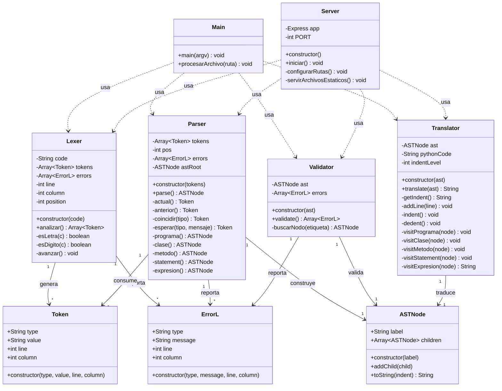
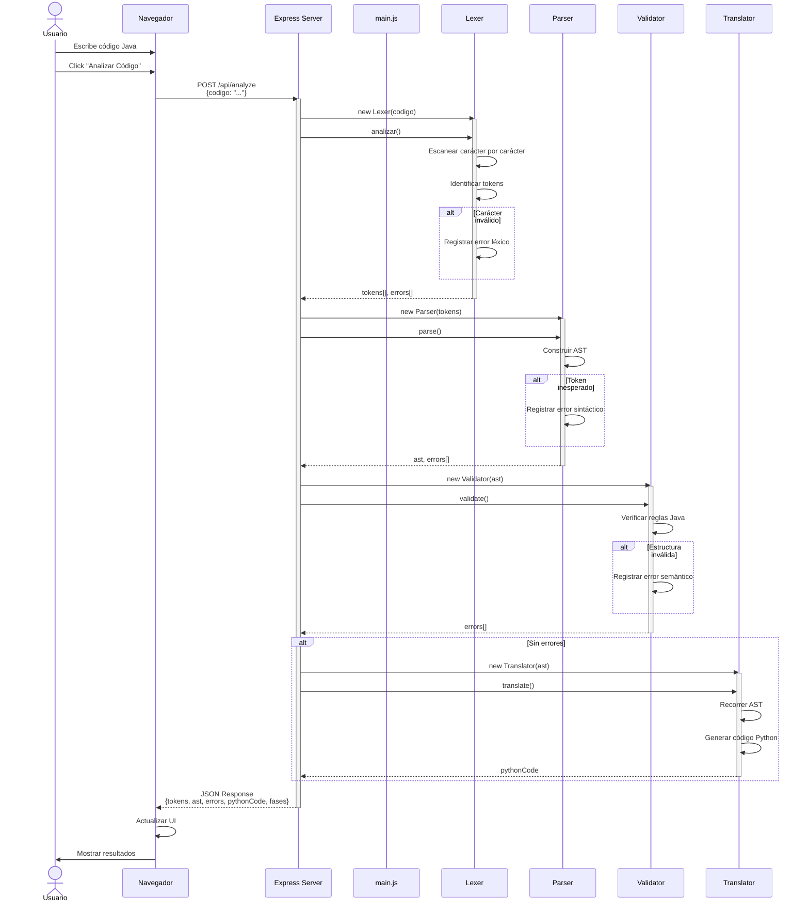
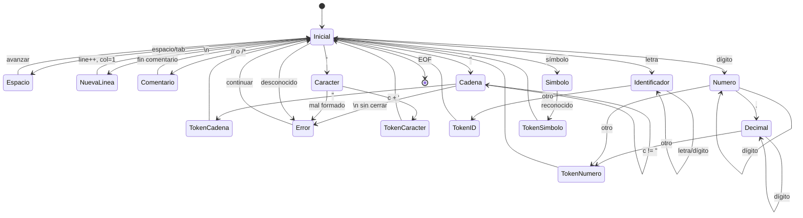
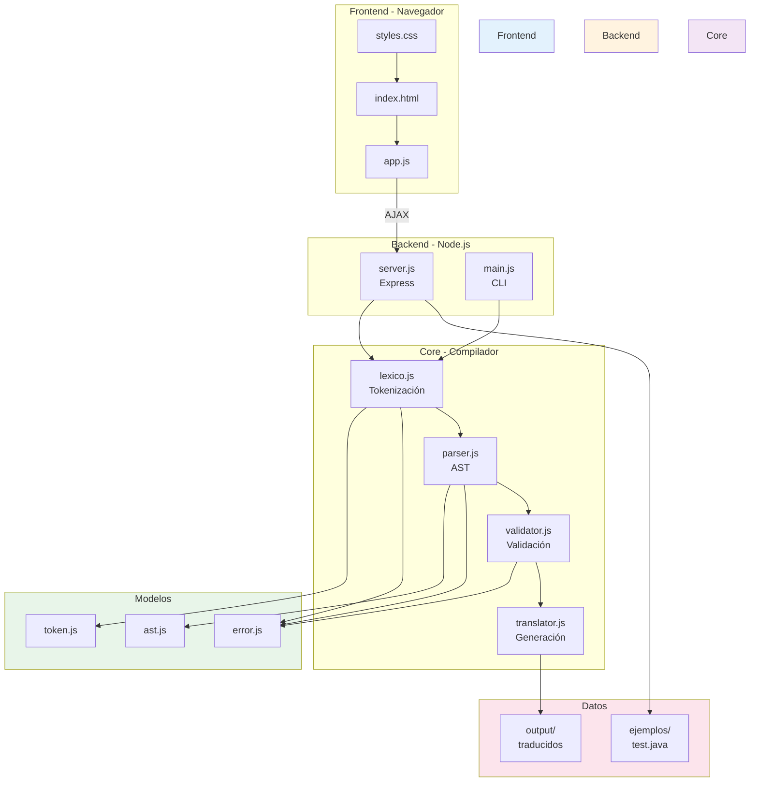
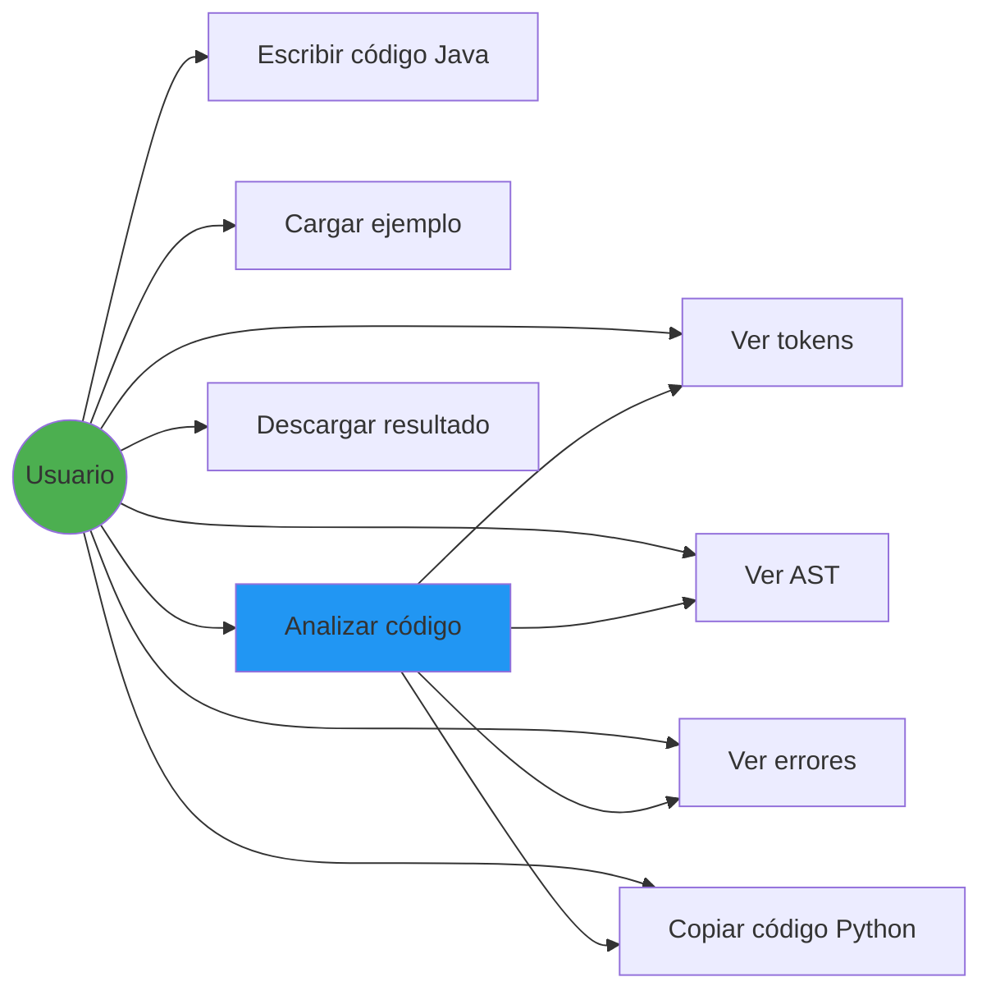
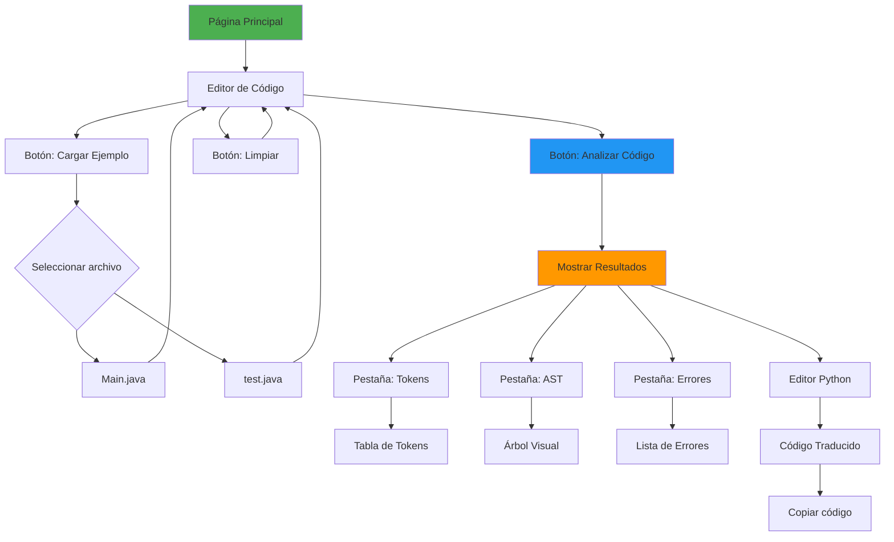
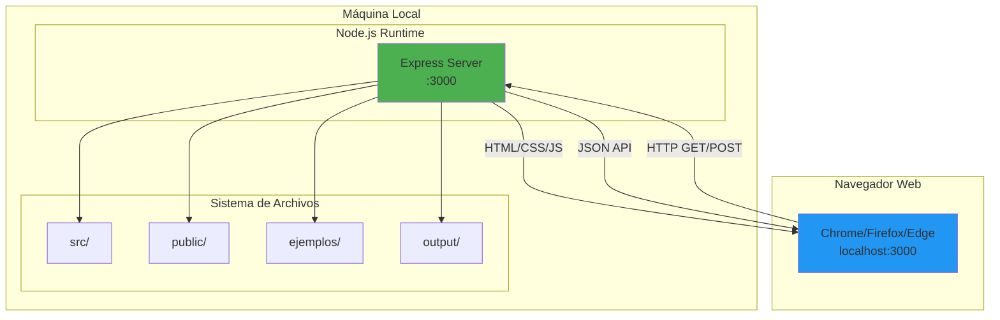

# 📊 Diagramas del Sistema

## 🎯 Diagrama de Clases Completo



---

## 🔄 Diagrama de Secuencia - Análisis Completo



---

## 🌳 Diagrama de Árbol Sintáctico (AST)

```mermaid
graph TD
    A[Programa] --> B[Clase]
    B --> C[Modificador: public]
    B --> D[Nombre: Main]
    B --> E[Metodo]
    
    E --> F[Modificador: public]
    E --> G[Modificador: static]
    E --> H[TipoRetorno: void]
    E --> I[Nombre: main]
    E --> J[Parametros]
    E --> K[Bloque]
    
    J --> L[Parametro]
    L --> M[Tipo: String[]]
    L --> N[Nombre: args]
    
    K --> O[DeclaracionVariable]
    K --> P[Println]
    
    O --> Q[Tipo: int]
    O --> R[Nombre: x]
    O --> S[Numero: 10]
    
    P --> T[Variable: x]
    
    style A fill:#e1f5ff
    style B fill:#fff4e6
    style E fill:#fff4e6
    style K fill:#f3e5f5
    style O fill:#e8f5e9
    style P fill:#e8f5e9
```

---

## 🔀 Diagrama de Flujo - Análisis Léxico

```mermaid
flowchart TD
    Start([Inicio]) --> Init[position = 0<br/>tokens = []<br/>errors = []]
    Init --> Loop{position < length?}
    
    Loop -->|No| End([Retornar tokens])
    Loop -->|Sí| GetChar[c = code[position]]
    
    GetChar --> CheckSpace{¿Espacio o tab?}
    CheckSpace -->|Sí| Advance1[avanzar<>]
    Advance1 --> Loop
    
    CheckSpace -->|No| CheckNewline{¿Salto de línea?}
    CheckNewline -->|Sí| NewLine[line++<br/>column=1]
    NewLine --> Advance2[avanzar<>]
    Advance2 --> Loop
    
    CheckNewline -->|No| CheckComment{¿Comentario?}
    CheckComment -->|// o /* */| SkipComment[Saltar comentario]
    SkipComment --> Loop
    
    CheckComment -->|No| CheckString{¿Comilla doble?}
    CheckString -->|Sí| ParseString[Extraer cadena]
    ParseString --> CheckStringError{¿Sin cerrar?}
    CheckStringError -->|Sí| AddError1[Agregar error]
    CheckStringError -->|No| AddToken1[Agregar CADENA]
    AddError1 --> Loop
    AddToken1 --> Loop
    
    CheckString -->|No| CheckChar{¿Comilla simple?}
    CheckChar -->|Sí| ParseChar[Extraer carácter]
    ParseChar --> AddToken2[Agregar CARACTER]
    AddToken2 --> Loop
    
    CheckChar -->|No| CheckLetter{¿Letra o _?}
    CheckLetter -->|Sí| ParseId[Extraer identificador]
    ParseId --> CheckKeyword{¿Palabra reservada?}
    CheckKeyword -->|Sí| AddKeyword[Agregar token palabra clave]
    CheckKeyword -->|No| AddId[Agregar IDENTIFICADOR]
    AddKeyword --> Loop
    AddId --> Loop
    
    CheckLetter -->|No| CheckDigit{¿Dígito?}
    CheckDigit -->|Sí| ParseNumber[Extraer número]
    ParseNumber --> AddNumber[Agregar NUMERO]
    AddNumber --> Loop
    
    CheckDigit -->|No| CheckSymbol{¿Símbolo conocido?}
    CheckSymbol -->|Sí| AddSymbol[Agregar token símbolo]
    AddSymbol --> Loop
    
    CheckSymbol -->|No| ErrorLex[Agregar error léxico]
    ErrorLex --> Advance3[avanzar<>]
    Advance3 --> Loop
    
    style Start fill:#4CAF50
    style End fill:#4CAF50
    style ErrorLex fill:#f44336
    style AddError1 fill:#f44336
```

---

## 🏗️ Diagrama de Flujo - Análisis Sintáctico

```mermaid
flowchart TD
    Start([parse<>]) --> ParseProg[programa<>]
    ParseProg --> ParseClass[clase<>]
    
    ParseClass --> CheckPublic{¿public?}
    CheckPublic -->|Sí| AddMod[Agregar modificador]
    CheckPublic -->|No| CheckClass
    AddMod --> CheckClass
    
    CheckClass{¿'class'?} -->|No| Error1[Error: Se esperaba 'class']
    CheckClass -->|Sí| ExpectId{¿IDENTIFICADOR?}
    
    ExpectId -->|No| Error2[Error: Se esperaba nombre]
    ExpectId -->|Sí| AddName[Agregar nombre clase]
    
    AddName --> ExpectBrace{¿'{'?}
    ExpectBrace -->|No| Error3[Error: Se esperaba '{']
    ExpectBrace -->|Sí| LoopMembers{¿Más miembros?}
    
    LoopMembers -->|No| ExpectClose{¿'}'?}
    LoopMembers -->|Sí| ParseMember[miembro<>]
    
    ParseMember --> CheckMethod{¿Es método?}
    CheckMethod -->|Sí| ParseMethod[metodo<>]
    CheckMethod -->|No| ParseVar[declaracionVariable<>]
    
    ParseMethod --> AddMember1[Agregar al AST]
    ParseVar --> AddMember2[Agregar al AST]
    AddMember1 --> LoopMembers
    AddMember2 --> LoopMembers
    
    ExpectClose -->|No| Error4[Error: Se esperaba '}']
    ExpectClose -->|Sí| Return[Retornar AST]
    
    Error1 --> Return
    Error2 --> Return
    Error3 --> Return
    Error4 --> Return
    
    Return --> End([Fin])
    
    style Start fill:#2196F3
    style End fill:#2196F3
    style Error1 fill:#f44336
    style Error2 fill:#f44336
    style Error3 fill:#f44336
    style Error4 fill:#f44336
```

---

## 🔍 Diagrama de Estados - Lexer



---

## 📊 Diagrama de Componentes



---

## 🎯 Diagrama de Casos de Uso



---

## 🗺️ Diagrama de Navegación - Interfaz Web



---

## 🔧 Diagrama de Despliegue



---

**Colección completa de diagramas del sistema 📊**
